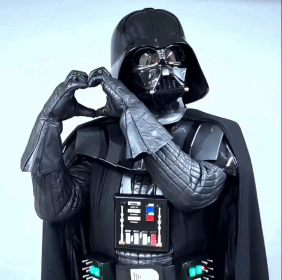

<!-- 

  
  
  

 -->

<!-- ### ¡Hola! Soy Víctor 👋  -->

<!-- ### ¡Hola! Soy Víctor 👋 -->

## 🚀 Frontend Developer | Especialista en Arquitecturas Escalables

+6 años de experiencia como Frontend Developer en consultoras y startups de alto crecimiento, diseñando arquitecturas frontend escalables y mantenibles basadas en principios de DDD y SOLID. Especializado en Vue.js y Nuxt, con enfoque en Atomic Design, la atención al detalle y la calidad de código para desarrollar web apps robustas, desacopladas y orientadas a las necesidades del negocio.

### 👋 Un poco sobre mí

- 📍 **Basado en:** Valencia, Venezuela.
- 💻 **Experiencia:** +6 años como Frontend Developer
- 🧩 **Especialidad:** Vue.js, Nuxt y la arquitectura en el frontend.
- 📚 **Compromiso:** DDD, SOLID, Clean Code y documentación como pilares de desarrollo.
- 🧱 **Metodología:** Defensor de los Design Systems y Atomic Design.
- 🎨 **Mindset:** Obsesión por el detalle (Pixel Perfect) y excelencia en UI/UX.
- 🌌 **Intereses:** Fan de Star Wars.

---

### 🤝 Conecta conmigo:

<!-- 
 -->

  <!--  -->

<!-- 
 -->

---

### 💻 Stack Tecnológico:

  
 
 
 
 
 
 
 
 
 
 
 
 
 
 

### 🔨 Herramientas

  
 
 
 
 
 

<!--   -->

### 🧰 Metodologías y Prácticas:

  
 
 
 
 
 
 
 
 
 
 

---

### ⚙️ Estadísticas de GitHub

<table>
  <tr>
    <td>
      
    </td>
    <td>
      
    </td>
  </tr>
</table>

---

### 🚀 Proyecto Destacado

- Design System para Dashboards con componentes reutilizables basados en la metodología Atomic Design
  [https://github.com/vicventum/design-system-dashboard-devmunity](https://github.com/vicventum/design-system-dashboard-devmunity)

---
